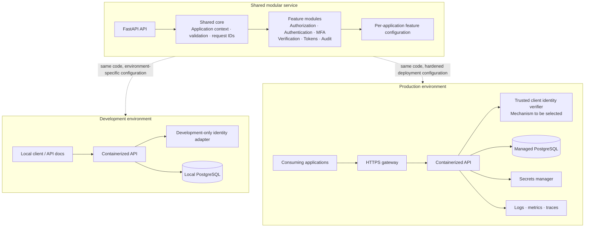

# Alzando Authorization Service

Initial feature slice: application-scoped RBAC APIs for creating roles and permissions, assigning permissions to roles, assigning roles to application users, and checking authorization.

## Architecture and environments

The service starts as a modular monolith. Features share one API process and common request, identity, configuration, and audit boundaries, then are integrated one feature at a time.



## Development stack

- Python 3.12, FastAPI, and Pydantic
- PostgreSQL 16, SQLAlchemy, and Alembic migrations
- Docker Compose for a local API and database

Development uses PostgreSQL to match the production database family. Production hosting and the production application-client authentication mechanism remain open choices. The service only trusts an application identity placed in `request.state.application_id` by a trusted authentication layer. In development only, `X-Dev-Application-Id` simulates this context. Production ignores that header and returns `UNAUTHENTICATED` until the production identity adapter is integrated.

## Start the development stack

Install Docker Desktop, then run from the repository root:

```bash
docker compose up --build
```

The API is available at `http://localhost:8000`; interactive API docs are at `http://localhost:8000/docs`. The first startup applies the checked-in Alembic migration. Local PostgreSQL data is kept in the `postgres_data` Docker volume.

For local API calls, include a development-only application context header:

```http
X-Dev-Application-Id: app_local
```

Do not use development credentials or this header in production.

## Implemented API surface

| Method | Path | Purpose |
|---|---|---|
| `POST` | `/api/v1/authorization/roles` | Create an application-scoped role |
| `POST` | `/api/v1/authorization/permissions` | Create an application-scoped permission |
| `PUT` | `/api/v1/authorization/roles/{role_id}/permissions` | Replace a role's complete permission set |
| `PUT` | `/api/v1/authorization/users/{user_reference}/roles` | Replace a user's complete role set |
| `POST` | `/api/v1/authorization/check` | Return an `ALLOWED` or `DENIED` RBAC decision |

All five operations scope their queries to the authenticated application. Relationship tables also use composite foreign keys to prevent cross-application role and permission links. Empty arrays on either `PUT` endpoint clear the corresponding assignments. Resource context is accepted and echoed, but V1 does not evaluate ownership or resource-level rules.

## Production integration still required

- Trusted client authentication middleware that verifies credentials and sets `request.state.application_id`.
- Deployment configuration, managed PostgreSQL, secret storage, TLS, and operational monitoring.
- Per-application Authorization service enablement enforcement once integrated with Alzando's application configuration service.

## API response envelope

Successes and service errors use the working response shape from the Alzando specification: `success`, `status`, `data`, `error`, and `request_id`. The exact public contract and HTTP mappings remain subject to the specification's open design decisions.
