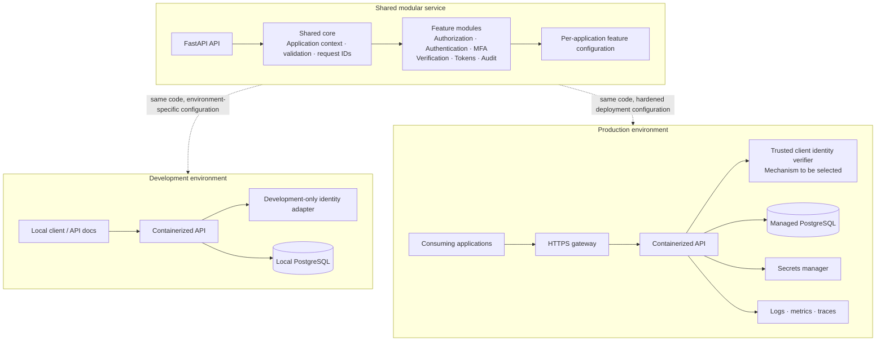

# Alzando Authorization Service

Initial feature slice: application-scoped RBAC APIs for creating roles and permissions, assigning permissions to roles, assigning roles to application users, and checking authorization.

## Architecture and environments

The service starts as a modular monolith. Features share one API process and common request, identity, configuration, and audit boundaries, then are integrated one feature at a time.



## Development stack

- Python 3.12, FastAPI, and Pydantic
- PostgreSQL 16, SQLAlchemy, and Alembic migrations
- Docker Compose for a local API and database

Development uses PostgreSQL to match the production database family. Confidential back-end applications authenticate with OAuth 2.0 client credentials. The service issues short-lived RS256 access tokens and derives the application identity and granted scopes from validated token claims. In development only, `X-Dev-Application-Id` remains available for quick API exploration. Production ignores that header. Public browser and mobile clients must not use client secrets; a separate public-client flow is a later feature.

## Start the development stack

Install Docker Desktop, then run from the repository root:

```bash
docker compose up --build
```

The API is available at `http://localhost:8000`; interactive API docs are at `http://localhost:8000/docs`. Startup applies checked-in Alembic migrations. Local PostgreSQL data is kept in the `postgres_data` Docker volume. After pulling code that changes dependencies or migrations, rebuild with `docker compose up --build`.

For local API calls, include a development-only application context header:

```http
X-Dev-Application-Id: app_local
```

Do not use development credentials or this header in production.

To provision a confidential client locally, open another VS Code terminal in the repository and run:

```powershell
docker compose exec api python -m alzando_authorization.cli create-client --application-id app_local --scope authorization:manage --scope authorization:check
```

The command prints the `client_id` and `client_secret` once. Save the secret securely; the database stores only its Argon2 hash. The command provisions clients out of band; there is no public client-registration endpoint.

Request a token from PowerShell, replacing the values with the CLI output:

```powershell
$pair = "CLIENT_ID:CLIENT_SECRET"
$basic = [Convert]::ToBase64String([Text.Encoding]::UTF8.GetBytes($pair))
$tokenResponse = Invoke-RestMethod -Method Post -Uri http://localhost:8000/oauth2/token -Headers @{ Authorization = "Basic $basic" } -ContentType "application/x-www-form-urlencoded" -Body @{ grant_type = "client_credentials"; scope = "authorization:manage authorization:check" }
$token = $tokenResponse.access_token
```

Send `Authorization: Bearer $token` with API calls. Role, permission, and assignment endpoints require `authorization:manage`; the decision endpoint requires `authorization:check`. In development the header shortcut above remains available.

## Implemented API surface

| Method | Path | Purpose |
|---|---|---|
| `POST` | `/api/v1/authorization/roles` | Create an application-scoped role |
| `POST` | `/api/v1/authorization/permissions` | Create an application-scoped permission |
| `PUT` | `/api/v1/authorization/roles/{role_id}/permissions` | Replace a role's complete permission set |
| `PUT` | `/api/v1/authorization/users/{user_reference}/roles` | Replace a user's complete role set |
| `POST` | `/api/v1/authorization/check` | Return an `ALLOWED` or `DENIED` RBAC decision |
| `POST` | `/oauth2/token` | Issue a short-lived access token to a confidential client |

All five operations scope their queries to the authenticated application. Relationship tables also use composite foreign keys to prevent cross-application role and permission links. Empty arrays on either `PUT` endpoint clear the corresponding assignments. Resource context is accepted and echoed, but V1 does not evaluate ownership or resource-level rules.

## Production deployment requirements

- Set `TOKEN_ISSUER`, `TOKEN_AUDIENCE`, and `JWT_PRIVATE_KEY_FILE` to production values. Mount the signing key from a secret manager; never commit it to Git. `JWT_PUBLIC_KEY_FILE` can supply the verification key separately.
- Use managed PostgreSQL, secret storage, TLS, and operational monitoring.
- Per-application Authorization service enablement enforcement once integrated with Alzando's application configuration service.
- Public-client authentication and delegated user flows are not part of this client-credentials feature.

## API response envelope

Successes and service errors use the working response shape from the Alzando specification: `success`, `status`, `data`, `error`, and `request_id`. The exact public contract and HTTP mappings remain subject to the specification's open design decisions.
